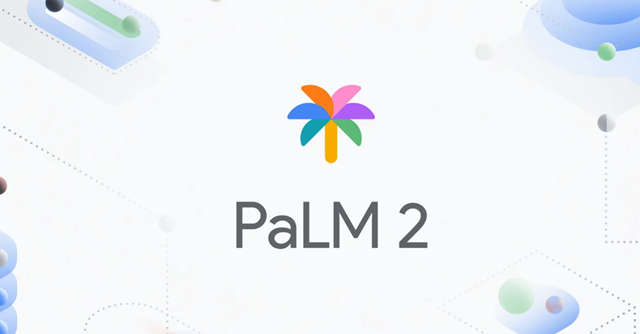

==================

## Intro
Introducing **TELLYOU**: Do you want to finally fully automate writing emails? Or to have someone who understands you as if they were you? Or if you want to have a digitilized version of yourself to boost your social media activity, TELLYOU will be there to help. Train your digital self with text from chats or, in future, even voice from phone calls.


## Features
### 1. PaLM 2


TELLYOU utilizes Google's PaLM 2 for text, a powerful large language model that serves as the foundation for our module. We used few-shot prompting to set it as an imaginery user persona.

### 2. Vertex AI


By leveraging Google Cloud Platform Vertex AI's API, TELLYOU can generate human-like responses based on user input. Our endpoint can scale easily and it integrates seamlessly with other future components.

## Getting Started

To recreate our application, the easiest way to get started is to clone the repository:

```bash
# Get the latest snapshot
git clone https://github.com/balintdecsi/junctionx23-aa.git myproject

# Change directory
cd myproject

# Install dependencies
python3 -m pip install -r requirements.txt

# Log in to your Google Cloud PLatform account
gcloud auth login

# Build the application and host it on App Engine
gcloud app deploy
```


## Usage of the product

Just open our [demo site](https://metal-node-406211.lm.r.appspot.com/): 

The best way to get familiar with our product is to watch our submission video:
[TELLYOU submission](https://www.youtube.com/watch?v=ml1NTOlKZxg)
